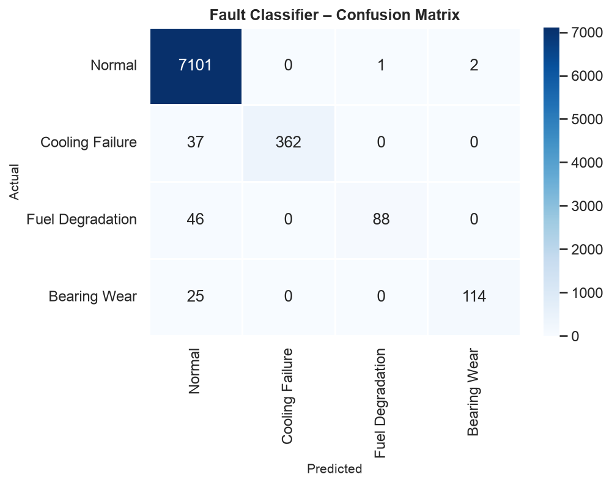
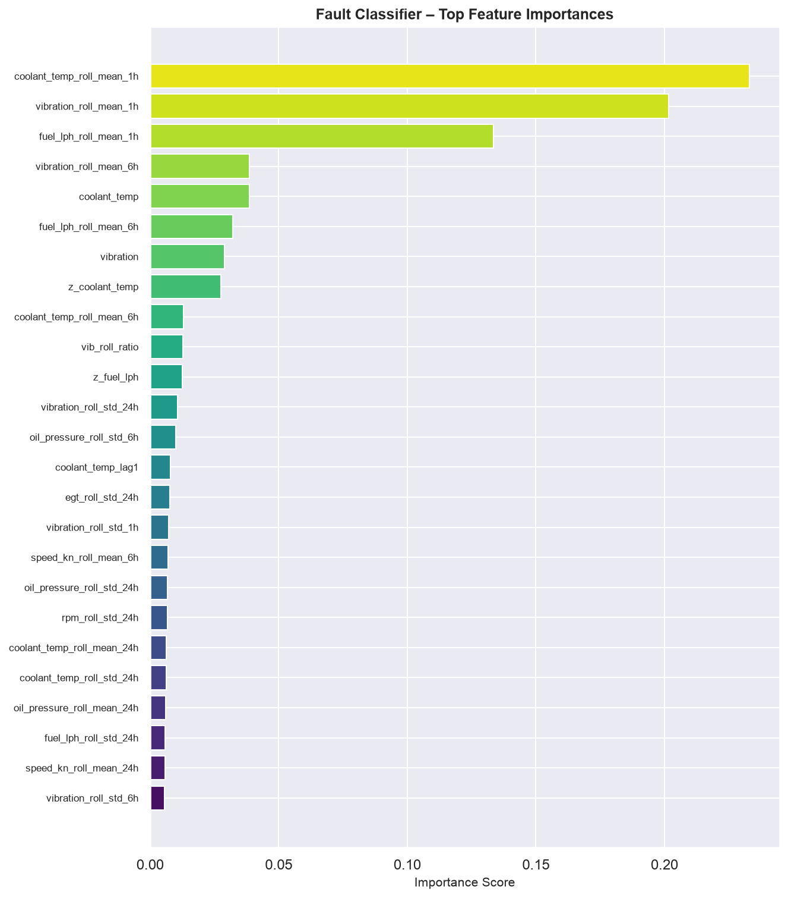
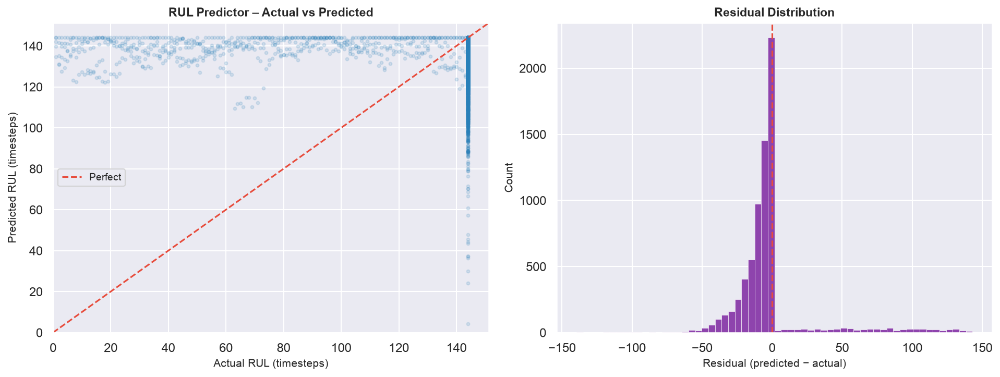
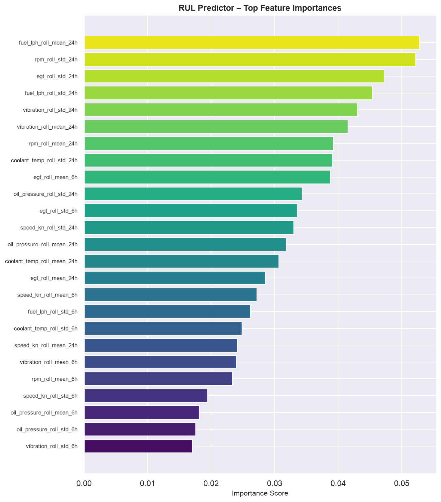

# ShipGuard — Marine Vessel Predictive Maintenance

An end-to-end ML pipeline for anomaly detection, fault classification, and
remaining-useful-life (RUL) estimation over multi-sensor ship telemetry.

---

## Motivation

Modern vessels are instrumented with dozens of sensors tracking engine RPM,
coolant temperature, exhaust gas temperature, fuel consumption, vibration,
oil pressure, and vessel speed.  Unplanned equipment failures are costly; in
marine operations, an undetected bearing failure or cooling-system fault can
lead to loss of propulsion, costly dry-dock visits, and safety incidents.

ShipGuard demonstrates how a data-driven approach that combining sensor data
pipelines, feature engineering, and multiple complementary ML models can
detect emerging faults hours before they become critical.  The architecture
mirrors the **digital twin** paradigm: continuous ingestion of sensor streams,
real-time model inference, and actionable insight generation.

---

## Pipeline

`data_generator.py` simulates 90 days of 10-minute readings (RPM, coolant
temp, exhaust gas temp, fuel flow, vibration, oil pressure, speed) across
three vessels, injecting three fault types: cooling failure, fuel
degradation, and bearing wear as gradual multi-hour drifts. `pipeline.py`
cleans and chronologically splits the data; `features.py` engineers ~90
features (rolling stats, lags, deltas, cross-sensor ratios) plus a capped
RUL label (steps until the next fault, capped at 144 = 24h). `models.py`
trains three models: an Isolation Forest (unsupervised anomaly detection),
an XGBoost classifier (fault type), and an XGBoost regressor (RUL). Run with
`python main.py`.

### 1 · Ingestion & Cleaning (`src/pipeline.py`)

- Parse timestamps; sort per vessel
- Linear interpolation for short gaps (≤ 3 consecutive NaNs); forward-fill residuals
- IQR-fence outlier clipping (k = 4) per vessel per column
- Chronological 80/20 train-test split (no look-ahead leakage)
- Z-score normalisation fit on train data only

### 2 · Feature Engineering (`src/features.py`)

Starting from 7 raw sensor channels, the pipeline produces **~130 features**:

| Category | Examples |
|---|---|
| Rolling mean | `coolant_temp_roll_mean_6h` |
| Rolling std | `vibration_roll_std_24h` |
| Rate of change | `rpm_delta` |
| Lag features | `fuel_lph_lag6` (60 min ago) |
| Cross-sensor ratios | `fuel_per_speed`, `egt_per_rpm`, `vib_roll_ratio` |
| RUL label | Steps until next fault onset (capped at 144 / 24 h) |

---

## Results

### Anomaly detection (Isolation Forest)

| | Precision | Recall | F1 |
|---|---|---|---|
| Normal | 0.97 | 0.94 | 0.95 |
| Anomaly | 0.52 | 0.71 | 0.60 |

Trained with zero fault labels, it still catches 71% of anomalies, at the
cost of a lot of false positives (52% precision). That trade-off is expected
for unsupervised detection and is exactly why it's paired with a supervised
classifier below rather than used standalone, its job is to be a noisy
first-pass filter, not a final verdict.

### Fault classification (XGBoost) — macro F1 0.91, ROC-AUC 0.95



The confusion matrix above shows a clean error pattern: **every
misclassification lands in "Normal". None of the three fault types are
ever confused with each other.**

| Fault | Missed (labelled Normal) | Recall |
|---|---|---|
| Cooling Failure | 37 / 399 (9.3%) | 0.91 |
| Bearing Wear | 25 / 139 (18.0%) | 0.82 |
| Fuel Degradation | 46 / 134 (34.3%) | 0.66 |

Fuel degradation is markedly the hardest to catch:



The top three features: `coolant_temp_roll_mean_1h`,
`vibration_roll_mean_1h`, and `fuel_lph_roll_mean_1h` account for over 55% of
total importance and map one-to-one onto the three fault signatures, each
keying off a short 1-hour window (the model reacts to recent drift, not
long-term trend). What differs is signal-to-noise: the injected fault
magnitude relative to each sensor's own baseline noise is roughly 10–20× for
vibration, 5–10× for coolant temp, but only 2.5–7.5× for fuel flow. Fuel
degradation isn't poorly modelled, it's a genuinely weaker signal given how
these three sensors are scaled, and the classifier's errors reflect that
honestly rather than indicating a tuning problem.

### Remaining useful life (XGBoost regression) — MAE 15.6 steps (2.6h), **R² = −0.294**



The negative R² is the headline finding, and the scatter above shows why.
About 90% of evaluated rows sit exactly at the 144-step cap (no fault due
within 24h); visible as the dense vertical band at the right edge, with
predictions correctly clustering near the top for that majority case. But
the same plot shows predictions barely move down even when actual RUL drops
to single digits: real pre-fault countdown rows scatter across the bottom of
the x-axis while their predictions stay pinned near the top. The model has
essentially learned "predict close to the cap," not "track the countdown."



This is consistent with the importance plot above: scores are far more
diffuse than the classifier's (top feature ≈0.05 vs. the classifier's
≈0.23) and dominated by 24-hour windows rather than 1-hour ones, the right
horizon conceptually for "how long until," but no single feature gives the
model a strong enough signal to anchor on. The residual histogram (right
panel, above) makes the practical consequence concrete: a sharp spike at 0
(the cap rows, correctly called) and a small but real positive tail out to
+140, cases where the model says "144 steps left" while the true answer is
under 10. MAE looks respectable because the 90% majority dilutes it; R²
exposes that the model fails specifically on the 10% of rows that would
actually matter for maintenance scheduling.

---

## Takeaways

The detection/classification stack works well and fails in an
interpretable, low-risk way (errors collapse to "normal," never to the
wrong fault). RUL estimation, a hard-capped countdown trained 
with plain regression, does not work: it recognizes the dominant
"nothing's wrong" case but doesn't track real countdowns. That's a genuine
limitation of this label design, not a bug, and the natural next step would
be reframing it as a classification problem ("failure within next Xh: yes
/no") or training the regressor only on pre-fault windows instead of
blending in the capped majority.

---

## Setup

```bash
pip install -r requirements.txt
python main.py               # full run
python main.py --no-plots    # skip figures
```

---

## Data

Synthetic telemetry is generated for **three vessels** over **90 days** at
10-minute intervals (~39 000 rows per vessel, ~117 000 total).

| Sensor | Normal range | Unit |
|---|---|---|
| Engine RPM | 350 – 950 | RPM |
| Coolant temperature | 70 – 95 | °C |
| Exhaust gas temperature | 300 – 450 | °C |
| Fuel consumption | 50 – 130 | L/h |
| Vibration (RMS) | 0.5 – 2.5 | mm/s |
| Lube-oil pressure | 3.5 – 6.0 | bar |
| Vessel speed | 8 – 18 | kn |

Three **fault types** are randomly injected at realistic durations (6–36 h):

| Label | Fault | Sensor signature |
|---|---|---|
| 1 | Cooling-system failure | Coolant temp + EGT rise |
| 2 | Fuel-system degradation | Fuel consumption drifts up; speed drops |
| 3 | Bearing wear | Vibration increases; RPM becomes noisy |

About 1 % of sensor readings include simulated dropout (NaN) to exercise the
cleaning pipeline.

---

## Models

### Anomaly Detector — Isolation Forest

**Goal:** flag unusual sensor states *without* requiring labelled fault data.  
Trained exclusively on normal-operation rows; at inference any point the model
finds anomalous is flagged.

- `contamination = 0.05`
- `n_estimators = 200`
- Evaluated via precision / recall / F1 against binary fault label

### Fault Classifier — XGBoost (multi-class)

**Goal:** when an anomaly is detected, identify which of the three fault types
is most likely.

- `objective = multi:softprob`, 4 classes
- `n_estimators = 400`, `max_depth = 6`, `learning_rate = 0.05`
- Evaluated via macro F1 and one-vs-rest ROC-AUC
- Feature importances exported and plotted

### RUL Predictor — XGBoost (regression)

**Goal:** estimate how many timesteps (× 10 min) remain before the next fault
onset, enabling proactive maintenance scheduling.

- Trained on pre-fault and normal rows only (active-fault rows excluded)
- RUL capped at 144 steps (24 h) so model focuses on near-term risk
- Evaluated via MAE (timesteps) and R²
- Residual distribution plotted to diagnose systematic bias

---

## Outputs

After `python main.py` completes, `reports/figures/` contains:

| File | Description |
|---|---|
| `eda_distributions.png` | KDE plots per sensor coloured by fault type |
| `sensor_overview_<vessel>.png` | Raw sensor time-series with fault shading |
| `anomaly_timeline_<vessel>.png` | Isolation Forest scores vs ground-truth labels |
| `confusion_matrix.png` | Fault classifier confusion matrix |
| `feature_importance_clf.png` | Top-25 features for fault classifier |
| `rul_scatter.png` | Actual vs predicted RUL + residual histogram |
| `feature_importance_rul.png` | Top-25 features for RUL predictor |

---

## Key Design Decisions

**Why Isolation Forest for anomaly detection?**  
In a real ship environment, labelled fault data is scarce and expensive to
collect.  Isolation Forest is well-suited to this regime: it requires no fault
labels during training and is robust to the highly correlated, multi-dimensional
sensor space typical of marine propulsion systems.

**Why XGBoost for classification and regression?**  
Gradient-boosted trees handle mixed feature scales, non-linear relationships,
and the moderate dataset size (< 1 M rows) efficiently, require little
hyperparameter tuning to produce strong baselines, and provide interpretable
feature importances, critical for engineer trust in a safety-critical domain.

**Why separate the RUL model from the fault classifier?**  
The fault classifier answers *"what is happening?"*; the RUL predictor answers
*"how urgent is it?"*.  Keeping them separate allows each to be updated or
replaced independently as more operational data becomes available.

**Chronological split strategy**  
Using a time-based split (rather than random shuffle) prevents data leakage
through the rolling-window and lag features, giving an honest estimate of
out-of-sample performance on future, unseen vessel states.

---

## Extending the Project

- **Real AIS / sensor data**: swap `data_generator.py` for a live ingest
  module reading from a Kafka stream, REST API, or SQL database.
- **Deep learning**: replace or augment the XGBoost models with an LSTM or
  Temporal Convolutional Network for richer sequence modelling.
- **Digital twin integration**: pipe model outputs into a 3-D vessel model
  (e.g. Unity or Unreal) via WebSocket for real-time visual alerts.
- **MLflow / experiment tracking**: wrap `main.py` in an MLflow run to log
  parameters, metrics, and artefacts automatically.
- **Deployment**: serve the classifier and RUL model via FastAPI with a
  Pydantic schema matching the sensor CSV columns.

---

## Project Structure

```
shipguard/
├── data/                       # Generated CSVs (auto-created on first run)
├── reports/
│   └── figures/                # All output plots (PNG)
├── src/
│   ├── data_generator.py       # Synthetic multi-vessel sensor data
│   ├── pipeline.py             # Ingestion, cleaning, normalisation, splitting
│   ├── features.py             # Rolling stats, lags, deltas, RUL labels
│   ├── models.py               # IsolationForest, XGBoost classifier & regressor
│   └── visualizations.py      # All matplotlib/seaborn plotting routines
├── main.py                     # End-to-end pipeline runner
├── requirements.txt
└── README.md
```

---

## Stack/Technologies

Python · Pandas · NumPy · Scikit-learn · XGBoost · Matplotlib · Seaborn

